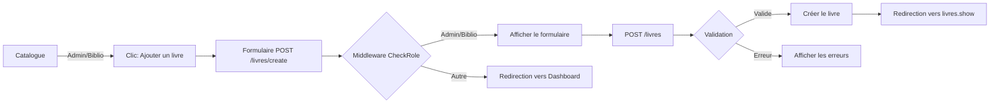

# 📚 Gestion des Rôles et Permissions — BiblioTech

## Vue d'ensemble

Le système BiblioTech utilise un modèle de **rôles simples** pour gérer les permissions d'accès aux différentes fonctionnalités de l'application.

---

## 🎭 Les Trois Rôles

### 1. **Admin** 👑
**Responsabilité :** Gérer l'application complète

**Permissions :**
- ✅ Accéder au tableau de bord Admin
- ✅ Gérer les utilisateurs (créer, modifier, supprimer)
- ✅ Modifier les rôles des utilisateurs
- ✅ Ajouter, modifier, supprimer des livres
- ✅ Ajouter, modifier, supprimer des catégories
- ✅ Afficher les statistiques et rapports
- ✅ Consulter le catalogue

**Routes accessibles :**
```
GET  /admin/utilisateurs
GET  /admin/utilisateurs/{id}
PATCH /admin/utilisateurs/{id}/role
DELETE /admin/utilisateurs/{id}
```

---

### 2. **Bibliothécaire** 📖
**Responsabilité :** Gérer le catalogue des livres

**Permissions :**
- ✅ Accéder au tableau de bord Bibliothécaire
- ✅ Ajouter, modifier, supprimer des livres
- ✅ Ajouter, modifier des catégories
- ✅ Consulter le catalogue complet
- ✅ Voir les utilisateurs (lecture seule)
- ❌ Modifier les rôles des utilisateurs
- ❌ Supprimer des utilisateurs

**Routes accessibles :**
```
GET  /livres
POST /livres
GET  /livres/create
GET  /livres/{id}
GET  /biblio/dashboard
```

---

### 3. **Utilisateur** 👤
**Responsabilité :** Consulter le catalogue

**Permissions :**
- ✅ Consulter le catalogue complet
- ✅ Rechercher et filtrer des livres
- ✅ Voir les détails d'un livre
- ✅ Accéder à son profil personnel
- ❌ Ajouter ou modifier des livres
- ❌ Ajouter ou modifier des catégories
- ❌ Accéder aux zones d'administration

**Routes accessibles :**
```
GET  /livres
GET  /livres/{id}
GET  /recherche
GET  /profile/edit
GET  /dashboard (tableau de bord utilisateur)
```

---

## 🔐 Système d'Authentification

### Routes Publiques (sans connexion)
```
GET  /              (page d'accueil)
GET  /about         (à propos)
GET  /login         (formulaire de connexion)
POST /login         (connexion)
GET  /register      (formulaire d'inscription)
POST /register      (inscription)
```

### Routes Protégées (authentification requise)
Toutes les autres routes demandent une connexion préalable :
```php
Route::middleware('auth')->group(function () {
    // Routes pour utilisateurs connectés
});
```

### Routes avec Rôle (authentification + rôle spécifique)
```php
// Admin uniquement
Route::middleware(['auth', 'role:admin'])->group(function () {
    // Routes admin
});

// Admin ou Bibliothécaire
Route::middleware(['auth', 'role:admin,bibliothecaire'])->group(function () {
    // Routes pour ajouter des livres
});
```

---

## 🚨 Middleware de Vérification des Rôles

### Classe : `App\Http\Middleware\CheckRole`

Le middleware vérifie que l'utilisateur connecté a l'un des rôles requis.

**Utilisation :**
```php
// Un seul rôle
Route::middleware(['auth', 'role:admin'])->group(function () {
    // ...
});

// Plusieurs rôles (séparés par virgule)
Route::middleware(['auth', 'role:admin,bibliothecaire'])->group(function () {
    // ...
});
```

**Code du middleware :**
```php
public function handle(Request $request, Closure $next, ...$roles): Response
{
    if (!auth()->check()) {
        return redirect('/login')->withErrors('Authentification requise');
    }

    if (empty($roles)) {
        return $next($request);
    }

    $userRole = auth()->user()->role;
    if (in_array($userRole, $roles)) {
        return $next($request);
    }

    return redirect('/dashboard')->withErrors('Vous n\'avez pas accès...');
}
```

---

## 📋 Tableau de Bord par Rôle

### 🎯 Admin Dashboard
- Vue d'ensemble des statistiques
- Gestion des utilisateurs
- Gestion des livres et catégories
- Rapports d'activité

### 📚 Bibliothécaire Dashboard
- Statistiques du catalogue
- Quick actions pour ajouter un livre
- Gestion des catégories
- Consultation des utilisateurs

### 👤 Utilisateur Dashboard
- Livres consultés récemment
- Recommandations personnalisées
- Gestion de son profil
- Historique de consultation

---

## 📊 Flux de Création d'un Livre



---

## 🔧 Helpers du Modèle Utilisateur

Pour vérifier le rôle d'un utilisateur dans le code ou les vues :

```php
// Dans le code PHP
if (auth()->user()->isAdmin()) {
    // ...
}

if (auth()->user()->isBibliothecaire()) {
    // ...
}

if (auth()->user()->isUtilisateur()) {
    // ...
}

// Dans les vues Blade
@if (auth()->user()->isAdmin())
    <button>Admin features</button>
@endif

@if (auth()->user()->isAdmin() || auth()->user()->isBibliothecaire())
    <a href="{{ route('livres.create') }}">Ajouter un livre</a>
@endif
```

---

## 📝 Base de Données

### Table `utilisateurs`

| Colonne | Type | Description |
|---------|------|-------------|
| `id` | BIGINT | Identifiant unique |
| `nom` | VARCHAR | Nom complet |
| `courriel` | VARCHAR | Email unique |
| `mot_de_passe` | VARCHAR | Mot de passe hashé (bcrypt) |
| **`role`** | VARCHAR | `'admin'`, `'bibliothecaire'`, `'utilisateur'` |
| `email_verified_at` | TIMESTAMP | Date de vérification de l'email |
| `remember_token` | VARCHAR | Token pour "Se souvenir de moi" |
| `created_at` | TIMESTAMP | Date de création |
| `updated_at` | TIMESTAMP | Date de modification |

---

## 🧪 Test des Rôles

### Via CLI (Tinker)
```bash
php artisan tinker

>>> use App\Models\Utilisateur;
>>> $admin = Utilisateur::where('role', 'admin')->first();
>>> $admin->isAdmin();  // true
>>> $admin->isBibliothecaire();  // false
```

### Utilisateurs de Test
```
Email: admin@bibliotech.test
Mot de passe: password
Rôle: admin

Email: biblio@bibliotech.test
Mot de passe: password
Rôle: bibliothecaire

Email: user@bibliotech.test
Mot de passe: password
Rôle: utilisateur
```

---

## 🔄 Migration et Seeding

### Créer la table avec rôle
```php
Schema::create('utilisateurs', function (Blueprint $table) {
    $table->id();
    $table->string('nom');
    $table->string('courriel')->unique();
    $table->string('mot_de_passe');
    $table->enum('role', ['admin', 'bibliothecaire', 'utilisateur'])->default('utilisateur');
    // ...
});
```

### Seeder avec rôles
```php
Utilisateur::create([
    'nom' => 'Admin',
    'courriel' => 'admin@bibliotech.test',
    'mot_de_passe' => bcrypt('password'),
    'role' => 'admin',
]);
```

---

## 📚 Routes Complètes par Rôle

### **Admin** : Accès Total
```
GET  /              (catalogue)
GET  /livres
GET  /livres/create          ✅ Admin + Biblio
POST /livres                 ✅ Admin + Biblio
GET  /livres/{id}
GET  /recherche
GET  /categories
GET  /dashboard              ✅ Tous
GET  /profile/edit           ✅ Tous
PATCH /profile/update        ✅ Tous
POST /logout                 ✅ Tous
GET  /admin/utilisateurs     ✅ Admin seul
GET  /admin/utilisateurs/{id} ✅ Admin seul
PATCH /admin/utilisateurs/{id}/role ✅ Admin seul
DELETE /admin/utilisateurs/{id}      ✅ Admin seul
GET  /biblio/dashboard       ⚠️ Biblio seul
```

### **Bibliothécaire** : Gestion du Catalogue
```
GET  /              (catalogue)
GET  /livres        ✅
GET  /livres/create ✅
POST /livres        ✅
GET  /livres/{id}   ✅
GET  /recherche     ✅
GET  /categories    ✅
GET  /dashboard     ✅
GET  /profile/edit  ✅
PATCH /profile/update ✅
POST /logout        ✅
GET  /biblio/dashboard ✅
```

### **Utilisateur** : Consultation Seule
```
GET  /              (catalogue)
GET  /livres        ✅
GET  /livres/{id}   ✅
GET  /recherche     ✅
GET  /categories    ✅
GET  /dashboard     ✅
GET  /profile/edit  ✅
PATCH /profile/update ✅
POST /logout        ✅
```

---

## 🎓 Compétences Visées

✅ Comprendre le concept de **rôle** et **permission**  
✅ Implémenter un middleware de vérification de rôles  
✅ Protéger les routes selon le rôle  
✅ Créer des tableaux de bord différents par rôle  
✅ Valider les permissions côté serveur (sécurité)  

---

## 🚀 Prochaines Étapes

1. **Permissions granulaires** : Passer à un système avec des permissions individuelles
2. **Audit** : Enregistrer toutes les actions critiques
3. **Rate limiting** : Limiter les tentatives de modification
4. **Notifications** : Alerter les admins des nouveaux livres ajoutés

